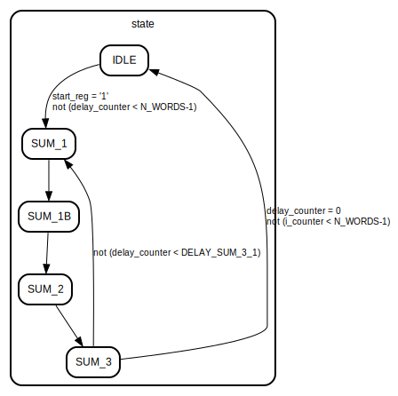

# Entity: FSM_add 

- **File**: FSM_add.vhd
## Diagram

## Description

 This FSM module controls the inputs of the 1W_ADDER combinatorial block. The adder should start s clock cycles after the "start" signal arrives.
 After starting, it has to compute 3 sums:
 * Sum1: 'Carry from fsm_mac_ab' + 'Previous computation of the adder'
 * Sum2: 'Result of sum1 ' + 'Carry from fsm_mac_mn'
 * Sum3: 'Carry of sum1' + 'Carry of sum2'

 After finishing it has to wait for (s-4) clocks (SUM_3_1) before accepting a new value from mac_ab.
 When all the computations for the current multiplication are done, it returns in the IDLE state, waiting
 for a new 'start' signal.
 
## Generics

| Generic name    | Type                     | Value | Description                      |
| --------------- | ------------------------ | ----- | -------------------------------- |
| N_WORDS         | POSITIVE range 4 to 8192 | 4     | Number of words per each operand |
| N_BITS_PER_WORD | POSITIVE range 8 to 512  | 32    | Number of bits per each word     |
## Ports

| Port name | Direction | Type                                          | Description                                            |
| --------- | --------- | --------------------------------------------- | ------------------------------------------------------ |
| clk       | in        | std_logic                                     | clock signal                                           |
| reset     | in        | std_logic                                     | asyncronous reset signal                               |
| start     | in        | std_logic                                     | start signal, tells the fsm when a new mult is started |
| c_in_ab   | in        | std_logic_vector (N_BITS_PER_WORD-1 downto 0) | carry in from mac_ab                                   |
| c_in_mn   | in        | std_logic_vector (N_BITS_PER_WORD-1 downto 0) | carry in from mac_mn                                   |
| c_out     | out       | std_logic_vector (N_BITS_PER_WORD-1 downto 0) | carry out from combinatorial adder                     |
| t_out     | out       | std_logic_vector (N_BITS_PER_WORD-1 downto 0) | result of combinatorial adder                          |
## Signals

| Name          | Type                                          | Description                                                                      |
| ------------- | --------------------------------------------- | -------------------------------------------------------------------------------- |
| state         | state_type                                    | FSM state signal                                                                 |
| a_sig         | std_logic_vector (N_BITS_PER_WORD-1 downto 0) | mainly used to load carry from outside                                           |
| b_sig         | std_logic_vector (N_BITS_PER_WORD-1 downto 0) | mainly used to load internal values                                              |
| start_reg     | std_logic                                     | start signal flipflop '1' -> a conversion is in progress.                        |
| c_out_reg     | std_logic_vector(N_BITS_PER_WORD-1 downto 0)  | signal to store c_out for Sum3                                                   |
| t_out_sig     | std_logic_vector(t_out'range)                 | signal linked to combinatorial adder t_out                                       |
| c_out_sig     | std_logic_vector(c_out'range)                 | signal linked to combinatorial adder c_out                                       |
| delay_counter | unsigned (9 downto 0)                         | counter to track cycles to wait before starting a new sum                        |
| i_counter     | unsigned (9 downto 0)                         | counter to keep track of current i_loop cycle (and return to idle when finished) |
## Constants

| Name          | Type                  | Value                                                             | Description |
| ------------- | --------------------- | ----------------------------------------------------------------- | ----------- |
| DELAY_SUM_3_1 | UNSIGNED (9 downto 0) | to_unsigned((N_WORDS - 4), 10) |             |
## Types

| Name       | Type                                                                                                                                                                            | Description    |
| ---------- | ------------------------------------------------------------------------------------------------------------------------------------------------------------------------------- | -------------- |
| state_type | (IDLE, SUM_1, SUM_1B, SUM_2, SUM_3) | FSM state type |
## Processes
- FSM: ( clk,reset )
## Instantiations

- add_1w: simple_1w_adder
## State machines

