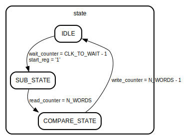

# Entity: FSM_sub_v2 

- **File**: FSM_sub_v2.vhd
## Diagram

## Description

 This module describes an FSM controlling the inputs of a combinatorial 1word subtractor. 
 It takes t and n respectively from the mac_mn/adder and from the n_memory, and it subtract the two word by word.
 It also stores both t and the result of the difference (t-n). At the end of the difference:
 * If t > n  (b_out = 0) => mult_result = t-n
 * If t <= n (b_out = 1) => mult_result = t

 In total, the block has to perform s+1 subtractions:
 * First s subtractions: t[i] - n[i] -> out_borrows are brought to input_borrow port again
 * Last subtraction: adder third sum result (t[s]) - prev_b_out
 At the end of the conversion an EoC signal is asserted for 1 clock cycle. When the output port is outputting valid data, the valid_out port is '1'
## Generics

| Generic name    | Type                     | Value | Description                 |
| --------------- | ------------------------ | ----- | --------------------------- |
| N_BITS_PER_WORD | POSITIVE range 8 to 512  | 32    | Number of bits per word     |
| N_WORDS         | POSITIVE range 4 to 8192 | 4     | Number of words per operand |
## Ports

| Port name   | Direction | Type                                          | Description                                                   |
| ----------- | --------- | --------------------------------------------- | ------------------------------------------------------------- |
| clk         | in        | std_logic                                     | clock signal                                                  |
| reset       | in        | std_logic                                     | asyncronous reset signal                                      |
| start       | in        | std_logic                                     | start signal (when '1', a new mult has started)               |
| EoC         | out       | std_logic                                     | End of Conversion signal. High for 1 clock when mult finished |
| valid_out   | out       | std_logic                                     | high when rersult is being written on output port             |
| t_in_mac    | in        | std_logic_vector (N_BITS_PER_WORD-1 downto 0) | t data coming from mac_mn                                     |
| t_in_add    | in        | std_logic_vector (N_BITS_PER_WORD-1 downto 0) | t data coming from adder                                      |
| n_in        | in        | std_logic_vector (N_BITS_PER_WORD-1 downto 0) | n coming from n memory                                        |
| mult_result | out       | std_logic_vector(N_BITS_PER_WORD-1 downto 0)  | final result of monmult                                       |
## Signals

| Name          | Type                                          | Description                                               |
| ------------- | --------------------------------------------- | --------------------------------------------------------- |
| state         | state_type                                    | FSM state signal                                          |
| diff_out_temp | out_temp_type                                 | memory to store difference before comparison              |
| t_out_temp    | out_temp_type                                 | memory to store t_in_mac before comparison                |
| start_reg     | std_logic                                     | flag signal: '1' means a multiplication is in progress    |
| read_counter  | natural range 0 to N_WORDS                    | counter for reads from mac, adder and n memory            |
| write_counter | natural range 0 to N_WORDS-1                  | counter for output writes                                 |
| wait_counter  | natural range 0 to CLK_TO_WAIT-1              | counter for waiting before starting subtraction           |
| t_in_sig      | std_logic_vector (N_BITS_PER_WORD-1 downto 0) | signal linked to first input of combinatorial subtractor  |
| n_in_sig      | std_logic_vector (N_BITS_PER_WORD-1 downto 0) | signal linked to second input of combinatorial subtractor |
| b_in_sig      | std_logic_vector (0 downto 0)                 | signal linked to input borrow of combinatorial subtractor |
| diff_out_sig  | std_logic_vector (N_BITS_PER_WORD-1 downto 0) | signal linked to out result of combinatorial subtractor   |
| b_out_sig     | std_logic_vector (0 downto 0)                 | signal linked to out borrow of combinatorial subtractor   |
| b_out_reg     | std_logic_vector (0 downto 0)                 |                                                           |
## Constants

| Name        | Type     | Value                     | Description                                     |
| ----------- | -------- | ------------------------- | ----------------------------------------------- |
| CLK_TO_WAIT | positive | N_WORDS * (N_WORDS-1) + 3 | clock cycles to wait before starting comparison |
## Types

| Name          | Type                                                                                                     | Description                                  |
| ------------- | -------------------------------------------------------------------------------------------------------- | -------------------------------------------- |
| state_type    | (IDLE,  SUB_STATE,  COMPARE_STATE) | FSM state type                               |
| out_temp_type |                                                                                                          | memory type to store words before comparison |
## Processes
- FSM: ( clk,reset )
  - **Description**
  FSM process 
## Instantiations

- sub_1w_inst: simple_1w_sub
## State machines

- FSM process
