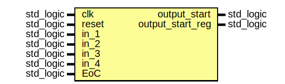

# Entity: start_regulator 

- **File**: start_regulator.vhd
## Diagram

## Description

takes as input the start output of the memories, and feeds to the modules and the memories a start signal, and it is useful if the memories are not filled at the same time

## Ports

| Port name        | Direction | Type      | Description                                                                              |
| ---------------- | --------- | --------- | ---------------------------------------------------------------------------------------- |
| clk              | in        | std_logic |                                                                                          |
| reset            | in        | std_logic |                                                                                          |
| in_1             | in        | std_logic | outputs of the memories, goes high when memory full, can be one cycle or more cycle long |
| in_2             | in        | std_logic | outputs of the memories, goes high when memory full, can be one cycle or more cycle long |
| in_3             | in        | std_logic | outputs of the memories, goes high when memory full, can be one cycle or more cycle long |
| in_4             | in        | std_logic | outputs of the memories, goes high when memory full, can be one cycle or more cycle long |
| EoC              | in        | std_logic | End of Conversion, resets the module when computation is over                            |
| output_start     | out       | std_logic | notifies the memories that the can start exposing on the rd_port                         |
| output_start_reg | out       | std_logic | notifies the computation modules that they can start reading                             |
## Signals

| Name                     | Type      | Description                                                                 |
| ------------------------ | --------- | --------------------------------------------------------------------------- |
| flag_1                   | std_logic | flags to hold the value '1' of the input signal                             |
| flag_2                   | std_logic | flags to hold the value '1' of the input signal                             |
| flag_3                   | std_logic | flags to hold the value '1' of the input signal                             |
| flag_4                   | std_logic | flags to hold the value '1' of the input signal                             |
| accept_1                 | std_logic | is '1' when the module has not yes stored a previous value '1'              |
| accept_2                 | std_logic | is '1' when the module has not yes stored a previous value '1'              |
| accept_3                 | std_logic | is '1' when the module has not yes stored a previous value '1'              |
| accept_4                 | std_logic | is '1' when the module has not yes stored a previous value '1'              |
| output_start_int         | std_logic | replica of output_start, needed in order for the output port to be readable |
| output_start_reg_int     | std_logic | replica of output_start delayed by one cylce                                |
| output_start_reg_reg_int | std_logic |                                                                             |
## Processes
- unnamed: ( clk, reset )
